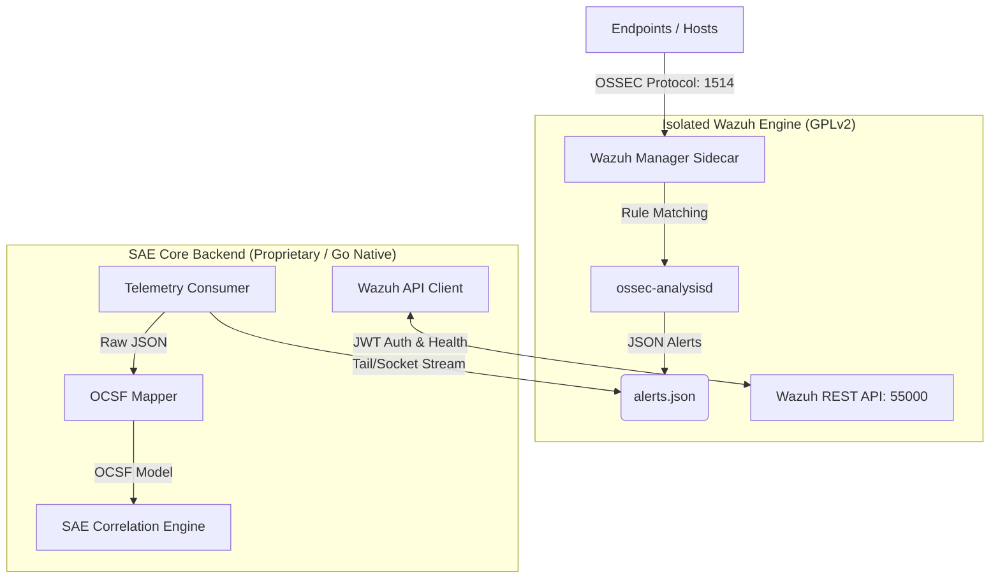

# SAE-Wazuh Architecture

## System Boundary

Wazuh is deployed as an isolated sidecar container alongside the SAE Core. 

## Security & Reliability Design
1. **Authentication:** SAE maintains an ephemeral JWT token via the `/security/user/authenticate` endpoint. Token rotation and expiration handling are built into the Go client.
2. **Timeouts:** The Go HTTP Client enforces a strict 10-second timeout to prevent the SAE Core from hanging if the Wazuh Manager fails to respond.
3. **Data Loss Prevention:** The telemetry consumer seeks to EOF and tails. In production, this will utilize an inode-tracking mechanism to ensure no alerts are lost during daemon restarts.
